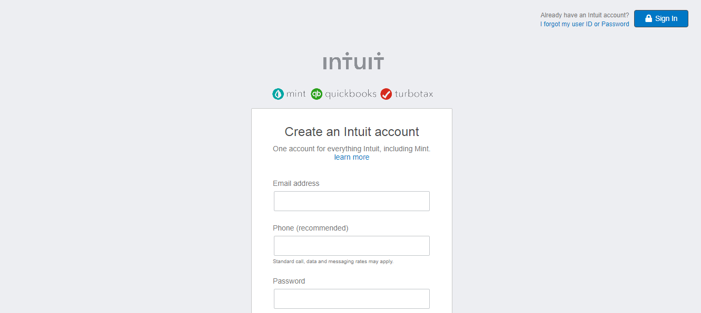

# Forms and Layout

> The goal of this project is to further our understanding of Forms in HTML&CSS. In order to do so we are going to replicate this [page](https://htmlpreview.github.io/?https://github.com/rsundar/mint-signup-page/blob/development_branch/index.html). 




## Built With

- HTML5,
- CSS3,


## Live Demo

[mint signup page clone](https://htmlpreview.github.io/?https://github.com/rsundar/mint-signup-page/blob/development_branch/index.html)


## Getting Started

**This is an example of how you may give instructions on setting up your project locally.**
**Modify this file to match your project, remove sections that don't apply. For example: delete the testing section if the currect project doesn't require testing.**


To get a local copy up and running follow these simple example steps.

### Prerequisites


- There are no prerequisites for this project. Only a text editor if you wish to edit the files.


### Setup


- Run ```$ git clone https://www.github.com/rsundar/mint-signup-page.git``` to clone the repo


### Install


- No installation required for this project.


### Usage

- Open the ```index.html``` file in the web browser of your choice.

### Run tests

- No tests on this page, only the W3 HTML5 validator was run.


### Deployment

- No Deployment.

## Authors

👤 **Rohan Sundar**

- Github: [rsundar](https://www.github.com/rsundar)


👤 **Ibunhabibu**

- Github: [Ibunhabibu](https://www.github.com/IBUNHABIBU)


## 🤝 Contributing

Contributions, issues and feature requests are welcome!

Feel free to check the [issues page](issues/).

## Show your support

Give a ⭐️ if you like this project!

## Acknowledgments

- Hat tip to anyone whose code was used
- Inspiration
- etc

## 📝 License

This project is [MiT](lic.url) licensed.